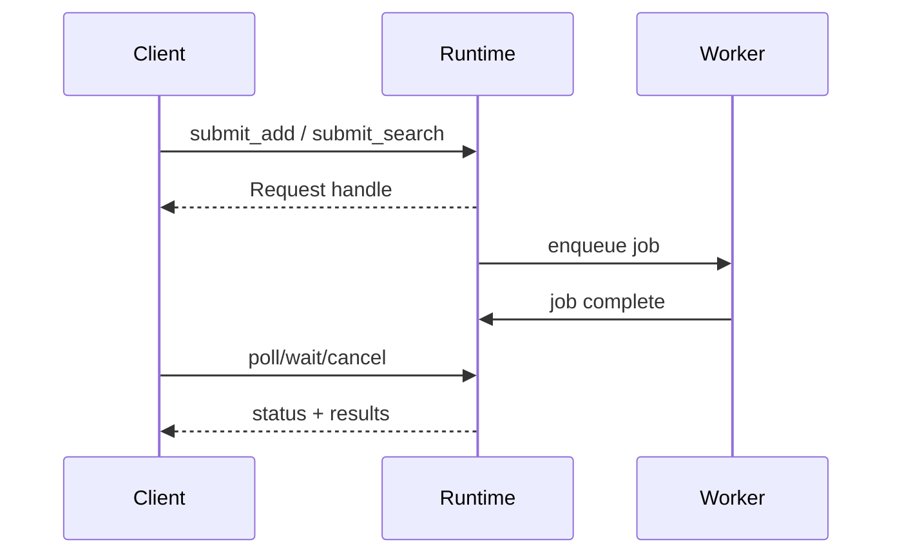
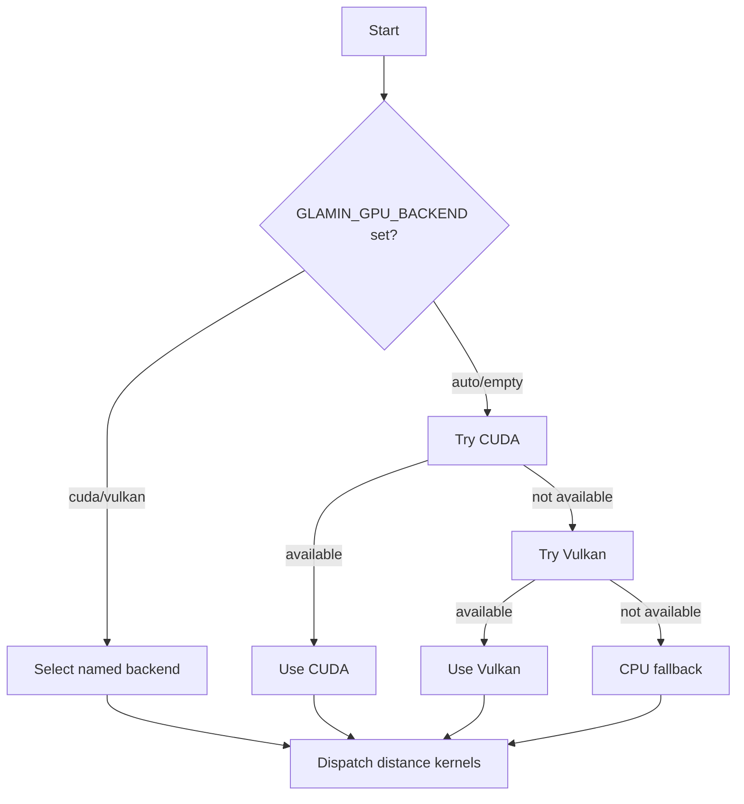
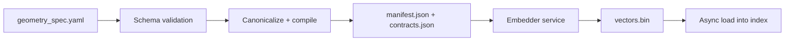

# Glamin

**Geometric Logical Application Meta-Instruction Network**

> *The index is the program. Distance is the instruction. Execution is traversal.*

---

## Status: Experimental

**Experimental, but real.** Core async runtime and index foundations exist; geometric logic layer is nascent. APIs will change. Not yet ready for production use.

See [Roadmap](#status) for current phase.

---

## Docs

- `docs/document_geometry_separation.md`
- `docs/space_contracts.md`
- `docs/geometry_diff.md`
- `docs/geometry_authoring.md`
- `docs/gpu_backends.md`

---

## What Already Works

- Async request lifecycle (submit/poll/wait/cancel).
- FAISS-compatible IO for Flat/PQ/IVF/IVFPQ/HNSW.
- Contract-enforced vector space integrity.

---

## The Idea

Glamin is a new compute primitive: **executable geometry**.

Traditional programs branch with `if/then/else`. Glamin programs branch by **position in vector space** — proximity to decision boundaries, confidence corridors, and behavioral neighbors.

A Glamin "program" is a manifold of vector embeddings where:
- **Meta-instructions (mints)** are points in the space
- **Corridors** are confidence regions around decision boundaries
- **Traces** are execution paths through the manifold
- **Distance calculations** are the instruction set

This isn't just vector search. It's **vector search as control flow**.

---

## Why Async-First?

Async vector storage doesn't exist. Every major library (FAISS, Annoy, HNSW) is synchronous. If you're building real-time systems — games, robotics, trading — you can't block on index updates.

Glamin provides **async in-process vector storage**:

```fortran
call submit_add(index, new_vectors, request)
! ... continue work immediately ...
call poll_request(request, status)
```

- Non-blocking add/search/update
- Request cancellation
- Priority queuing with backpressure
- Snapshot semantics for consistent reads

Even if you never use the geometric logic layer, async vector storage is worth the price of admission.

---

## FAISS Compatibility

Glamin adopts the FAISS file format as its native serialization. This means:

- **Interchangeability**: Glamin-built indexes load in FAISS, and vice versa
- **Ecosystem leverage**: Existing FAISS tools work out of the box
- **Migration**: Any FAISS index becomes a Glamin manifold immediately
- **Future-proof**: Your data isn't locked into a new format

We don't reinvent storage. We add execution.

---

## Contract Layer

Glamin enforces a **contract layer** that keeps vector spaces stable and auditable:

- **Space contracts** define `space_id`, dimension, metric, normalization, and invariants.
- **Embedder contracts** bind vectors to a specific model version, preprocessing chain, and hashes.
- **Manifests** accompany serialized data so mismatched vectors are rejected at load/write.

This prevents silent contamination between document and geometry spaces and makes
migrations explicit.

See `docs/space_contracts.md` for the full schema and enforcement rules.

Example (contract excerpt):

```yaml
space_id: geometry.app_state
dim: 1024
metric: l2
normalization: l2
embedder:
  id: geomnet
  version: 0.4.2
  model_hash: sha256:5a6b...
  config_hash: sha256:9f2c...
```

---

## The Vocabulary

Glamin introduces concepts no coding standard has covered before:

| Term | Meaning |
|------|---------|
| **Mint** | Meta-instruction embedded in vector space. Has coordinates, neighbors, and distance from other mints. |
| **Corridor** | Confidence region around a decision boundary. Wide = uncertainty. Narrow = conviction. |
| **Trace** | Execution path through the manifold. Not a call stack — a trajectory. |
| **Manifold** | The geometric space containing all mints and decision boundaries. |
| **Behavior** | Discrete unit of logical intent. Not a function — what the function *means*. |

---

## Async Request Lifecycle

All index operations are non-blocking and return a request handle.



---

## GPU Backend Selection



See `docs/gpu_backends.md` for configuration details.

---

## Geometry Spec Pipeline



The embedder runs out-of-process; the core accepts vectors only when a
matching embedder contract is attached.

---

## Architecture

```
Glamin Runtime
├── Async Execution Layer (Fortran 2018 + pthreads)
│   ├── Request lifecycle (submit/poll/wait/cancel)
│   ├── Worker pools with backpressure
│   └── Snapshot semantics for consistent reads
├── Geometric Logic Layer
│   ├── Mint registry and embedding
│   ├── Corridor definitions and confidence scoring
│   └── Trace execution and trajectory planning
├── Index Implementations (Fortran)
│   ├── Flat (exact search)
│   ├── IVF (inverted file)
│   ├── PQ (product quantization)
│   ├── IVFPQ (composite)
│   └── HNSW (graph navigation)
├── Distance Kernels (AVX2/AVX-512)
│   ├── L2 (Euclidean)
│   └── IP (inner product)
└── I/O Layer
    └── FAISS-compatible serialization
```

---

## Language Bindings

**Planned:**
- **Python** — Primary interface for AI/ML workflows
- **Go** — Systems integration, microservices
- **Rust** — Performance-critical applications, WASM targets

Core library is Fortran/C for maximum performance and portability. Bindings will follow once the native API stabilizes.

---

## Building

Requirements:
- Fortran 2018 compiler (`gfortran` 9+)
- C compiler (`gcc` or `clang`)
- `make`
- POSIX threads

```bash
make              # Build build/libglamin.a
make clean        # Remove build outputs
```

Optional tuning for distance kernels:

```bash
make DISTANCE_QUERY_BLOCK=16 DISTANCE_VECTOR_BLOCK=128
```

## Testing

GPU smoke test (CUDA emulation path):

```bash
make test-gpu
```

Async IVF + HNSW snapshot smoke tests:

```bash
make test-async
```

Distance kernel smoke test:

```bash
make test-distance
```

GPU backend selection smoke test:

```bash
make test-gpu-select
```

GPU backend fallback smoke test:

```bash
make test-gpu-fallback
```

---

## Repository Layout

```
src/
├── common/       # Types, errors, memory utilities
├── runtime/      # Async runtime, queues, worker pool
├── kernels/      # Distance kernels (SIMD-ready)
├── index/        # Index implementations (Flat, IVF, PQ, HNSW)
├── io/           # Serialization and FAISS compatibility
└── gpu/          # Pluggable GPU backend interface

tests/            # Correctness and parity tests
benchmarks/       # Performance micro-benchmarks
examples/         # Usage examples (to be added)
```

---

## Status

**Implemented**
- [x] Async request lifecycle
- [x] Worker pool with C threading
- [x] Distance kernel structure (AVX-ready)
- [x] Flat / IVF / PQ / IVFPQ / HNSW baselines
- [x] FAISS format compatibility for supported indices

**Hardening**
- [x] Snapshot integration for HNSW background builds
- [ ] SIMD-optimized distance kernels
- [ ] Parity test suite and regression harness

**Planned**
- [ ] Python bindings
- [ ] Go bindings
- [ ] Rust bindings

See [ROADMAP.md](ROADMAP.md) for detailed phases.

---

## Design Philosophy

1. **Async by default** — Blocking is opt-in, not the default
2. **FAISS-compatible** — Format adoption over format invention
3. **Geometric honesty** — Logic has shape. Respect the manifold.
4. **Strong typing** — Every variable knows exactly what it is
5. **Explicit confidence** — Uncertainty is a first-class value, not an edge case

See [STYLE_GUIDE.md](STYLE_GUIDE.md) for coding conventions.
